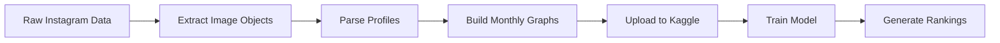

# InfluencerRank: Graph Convolutional Attentive RNN for Influencer Discovery

## Overview

This project uses heterogeneous graph neural networks (GAT + GRU) to predict influential social media accounts based on temporal interaction patterns between influencers, users, hashtags, and objects.

## Pipeline



## Quick Start

### Prerequisites

- Python 3.8+
- PyTorch 2.0+
- PyTorch Geometric
- NumPy, Pandas, Scikit-learn


## Complete Implementation Guide

### Step 1: Extract Image Objects

Use an object detection model () to extract objects from images:

```bash
# This step requires an object detection model
# Output should be: image_objects.csv
# Format: filename,object1,object2,...
```

Place the output in `image_objects.csv`.

### Step 2: Parse Profile Data

```bash
python parse_profiles.py
```

This creates `profiles_lookup.pkl` containing:
- Profile metadata (follower counts, bio, etc.)
- Profile features for graph building

### Step 3: Build Monthly Graphs

```bash
python build_enhanced_graphs_v3_fixed.py
```

This generates 12 monthly heterogeneous graphs in `graphs_enhanced_v3/`:
- `jan_graph.pt` through `dec_graph.pt`
- Each graph contains: influencer, user, hashtag, and object nodes
- 37 features per influencer node (29 effective after leakage masking)


### Step 4: Train the Model

Open and run the Jupyter notebook:

```bash
v8-final.ipynb
```

The notebook will:
1. Load 12 monthly graphs
2. Apply feature masking (prevent data leakage)
3. Normalize features (train-set only)
4. Train GAT + GRU model (~4 minutes)
5. Evaluate on test set (NDCG@50)
6. Save model to `saved_models_v8_final/`

### Step 5: Generate Rankings

Use the trained model to predict influencer rankings:

```bash
# Rank all influencers
python predict_rankings.py --cpu

# Rank test set only
python predict_rankings.py --use-test-set

# Custom output
python predict_rankings.py --output my_rankings.csv
```

**Output format:**
```csv
rank,influencer,predicted_score,actual_engagement
1,influencer_123,0.9456,128500
2,influencer_456,0.9234,115200
...
```

## Project Structure

```
.
├── README.md                              # This file
├── v8-final.ipynb                        # Main training notebook
├── predict_rankings.py                   # Inference script
├── build_enhanced_graphs_v3_fixed.py     # Graph builder
├── parse_profiles.py                     # Profile parser
├── graphs_enhanced_v3/                   # Generated graphs (gitignored)
├── saved_models_v8_final/                # Trained model (gitignored)
└── year_17/                              # Raw data (gitignored)
```

## Model Architecture

```
Input Features (37) → Mask Leaky Features (16)
    ↓
Graph Attention Network (2 layers, 128 hidden units)
    ↓
GRU (1 layer, 128 hidden units)
    ↓
Attention Mechanism (learned weights)
    ↓
Fully Connected (128 → 64 → 1)
    ↓
Engagement Score Prediction
```
